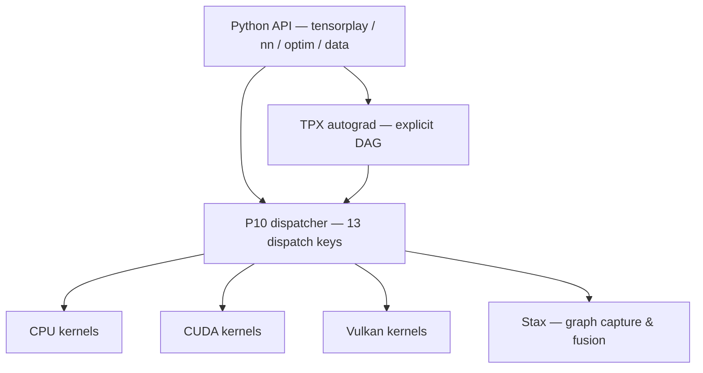

<h1 align="center">
    <picture>
        <source media="(prefers-color-scheme: dark)" srcset="https://raw.githubusercontent.com/lexing-2026/TensorPlay/main/docs/images/tensorplay-lockup-dark.png">
        <source media="(prefers-color-scheme: light)" srcset="https://raw.githubusercontent.com/lexing-2026/TensorPlay/main/docs/images/tensorplay-lockup.png">
        
    </picture>
</h1>

<div align="center">
<h3>
    <samp>Read the whole stack.</samp>
</h3>
<p>
    <samp>A learner-first, DIY-ready framework for tensors, kernels, and custom hardware.</samp>
</p>

<p>
    <a href="https://www.tensorplay.cn/en/guide/tutorials"><strong>Tutorials</strong></a> •
    <a href="https://www.tensorplay.cn/"><strong>Docs</strong></a> •
    <a href="#getting-started"><strong>Quick Start</strong></a> •
    <a href="#installation"><strong>Installation</strong></a>
</p>

<p>
    <a href="./README.md"><strong>EN</strong></a> ·
    <a href="./README.zh.md">中文</a>
</p>

<p>
    <a href="https://download.tensorplay.cn/project/tensorplay/">
        
    </a>
    <a href="https://download.tensorplay.cn/status/">
        
    </a>
    <a href="#installation">
        
    </a>
    <a href="./LICENSE">
        
    </a>
    <a href="https://download.tensorplay.cn/project/tensorplay/stats/">
        
    </a>
    <a href="#installation">
        
    </a>
</p>
</div>

<details>
<summary>Build matrix &amp; community signals</summary>

<p>
    <a href="https://github.com/lexing-2026/TensorPlay/actions/workflows/lint.yml">
        
    </a>
    <a href="./README.md">
        
    </a>
    <a href="./README.zh.md">
        
    </a>
</p>

<!-- Platform & Build -->
<p>
    
    
    
    
    
</p>

<!-- CI -->
<p>
    <a href="https://github.com/lexing-2026/TensorPlay/actions/workflows/trunk.yml">
        
    </a>
    <a href="https://github.com/lexing-2026/TensorPlay/actions/workflows/trunk.yml">
        
    </a>
    <a href="https://github.com/lexing-2026/TensorPlay/actions/workflows/trunk.yml">
        
    </a>
</p>

<!-- Community -->
<p>
    <a href="https://github.com/lexing-2026/TensorPlay/stargazers">
        
    </a>
    <a href="https://github.com/lexing-2026/TensorPlay/commits/main">
        
    </a>
    <a href="https://discord.gg/u6T5e2kGJm">
        
    </a>
    <a href="https://deepwiki.com/lexing-2026/TensorPlay">
        
    </a>
    <a href="https://www.tensorplay.cn/">
        
    </a>
</p>
</details>

--------------------------------------------------------------------------------

TensorPlay is a Python package that provides two high-level features:

- Tensor computation (like NumPy) with strong GPU acceleration
- Deep neural networks built on an explicit, tape-based autograd system

The whole stack — Python API, C++ core, CUDA kernels, compiler — is engineered to be read: clean implementations, explicit computation graphs, and no black box between your model and the hardware.

<!-- toc -->

- [About TensorPlay](#about-tensorplay)
  - [A Transparent Tensor Library](#a-transparent-tensor-library)
  - [Why TensorPlay](#why-tensorplay)
- [Installation](#installation)
  - [Binaries](#binaries)
  - [From Source](#from-source)
    - [Prerequisites](#prerequisites)
    - [Get the TensorPlay Source](#get-the-tensorplay-source)
    - [Install Build Dependencies](#install-build-dependencies)
    - [Install TensorPlay](#install-tensorplay)
    - [Adjusting Build Options (Optional)](#adjusting-build-options-optional)
- [Getting Started](#getting-started)
  - [Automatic Differentiation](#automatic-differentiation)
  - [Defining a Neural Network](#defining-a-neural-network)
  - [Training Loop](#training-loop)
- [Benchmarks](#benchmarks)
- [Testing](#testing)
- [Resources](#resources)
- [Communication](#communication)
- [Releases and Contributing](#releases-and-contributing)
- [License](#license)
- [The organization behind TensorPlay](#the-organization-behind-tensorplay)

<!-- tocstop -->

## About TensorPlay

### A Transparent Tensor Library

At a granular level, TensorPlay consists of the following components:

| Component | Description |
| ---- | ---- |
| **tensorplay** | The Python API: tensors, autograd, `nn`, `optim`, data loading, serialization — the public surface |
| **p10** | C++ core engine: tensor storage and memory management, foundational CPU and CUDA kernels |
| **tpx** | Autograd layer: explicit computation-graph construction and backward execution, fully decoupled from the core |
| **stax** | JIT compiler playground: static graph capture and operator fusion experiments, including native lowering of custom ops |
| **tensorplay.nn** | Neural network building blocks: `Module`, `Linear`, `Conv2d`, activations, losses, container abstractions |
| **tensorplay.optim** | Optimizers (SGD, Adam, AdamW) with learning-rate scheduling and weight decay |
| **tensorplay.data** | `Dataset` / `DataLoader` with multi-worker batching, prefetching and shuffling |
| **tensorplay.library** | First-class custom operators: register ops, attach fake/meta and autograd formulas, bring your own Triton kernels |

The four pillars — **P10**, **TPX**, **Stax** and **NN** — are deliberately decoupled libraries that can work together or independently. Domain subpackages such as `linalg`, `fft`, `sparse`, `special`, `amp`, `distributed` and `serialization` round out the API surface.

Every call is one short, visible path — no black box between your model and the hardware:



### Why TensorPlay

TensorPlay is built on a philosophy of **transparency**: you can trace every operation from Python into the C++ core without getting lost in abstraction layers.

- **Pure and readable implementations.** Dive into the logic of every operator — from autograd to memory management. No black boxes.
- **DIY acceleration.** Simplified CPU and CUDA backends are a playground for experimenting with custom hardware kernels and learning parallel computing.
- **Modular autograd.** The decoupled TPX engine builds computation graphs explicitly, making backpropagation easy to understand and extend.
- **Research ready.** Prototype new layer types, optimizers, custom operators and storage formats with minimal boilerplate.
- **Instantly familiar API.** If you have worked with mainstream deep learning frameworks, the mental model carries over — spend your time on internals, not syntax.

#### Familiar and Python-First

TensorPlay is not a thin binding over an opaque engine. The public surface — `tensorplay`, `nn`, `optim`, `data` — is pure Python you can read end to end, and every call crosses a small, explicit boundary into the C++ core. Stack traces, error messages and the debugger show *your* code, not framework plumbing.

#### DIY Hardware Acceleration

The CPU and CUDA backends are deliberately simplified: one kernel family per file, one registration macro per unit, no hidden scheduling. That makes them a playground for learning parallel computing and prototyping kernels — bring your own device backend and wire it into the dispatcher without touching the framework itself.

#### An Explicit Autograd Engine

The autograd engine (TPX) is a standalone library, fully decoupled from the core. Computation graphs are built and executed explicitly — no hidden state — so backpropagation is something you can read, trace and extend in an afternoon.

#### Extensions Without Pain

First-class custom operators: register an op with `tensorplay.library`, attach fake/meta formulas for shape inference and an autograd formula for backward, and it composes with the whole stack — including native lowering into the Stax compiler or your own Triton kernels.

## Installation

### Binaries

```bash
# CPU wheels from PyPI
pip install tensorplay --upgrade

# CUDA 13.0 wheels from the TensorPlay CUDA index
# Keep PyPI as an extra index for runtime dependencies.
pip install tensorplay \
  --index-url https://download.tensorplay.cn/whl/cu130/ \
  --extra-index-url https://pypi.org/simple
```

> [!NOTE]
> Make sure your Python version matches the wheel tags (e.g. `cp310` for Python 3.10). For CUDA wheels, the driver and runtime must support the CUDA version of the wheel.

> [!TIP]
> The CUDA 13.0 wheels target compute capability 8.6 GPUs only. If your GPU has a different compute capability (or the wheel fails to run on your device), [build from source](#from-source) instead and set `CMAKE_CUDA_ARCHITECTURES` to your target — it defaults to `native`, which auto-detects the local GPU.

### Nightly (preview) builds

Try tomorrow's features today: every change that passes our build-and-smoke pipeline lands on the rolling `nightly` channel automatically, following the nightly version format (`X.Y.0.dev<date>+cuXXX` / `+cpu`). Only the latest build per variant is kept.

```bash
# CUDA nightly
pip install --pre tensorplay \
  --index-url https://download.tensorplay.cn/whl/nightly/cu130/ \
  --extra-index-url https://pypi.org/simple

# CPU nightly
pip install --pre tensorplay \
  --index-url https://download.tensorplay.cn/whl/nightly/cpu/ \
  --extra-index-url https://pypi.org/simple
```

### From Source

Building from source gives you a hackable, debuggable install — the recommended setup for contributors and anyone working on kernels.

#### Prerequisites

- Python >= 3.10, < 3.14
- CMake >= 3.18 (< 4.0)
- A C++20-capable compiler (MSVC 2022 on Windows, GCC/Clang on Linux)
- CUDA Toolkit (optional, for GPU support); set `CMAKE_CUDA_ARCHITECTURES` to target specific GPU architectures
- ROCm 7.2.x (optional, for AMD GPU support); the HIP backend is currently built from source
- [Ninja](https://ninja-build.org/) (installed automatically with the build dependencies)

#### Get the TensorPlay Source

```bash
git clone https://github.com/lexing-2026/TensorPlay.git
cd TensorPlay
```

The repository does not carry the third-party sources in git. Fetch the pinned revisions (vector math, distributed transports, Vulkan headers, ...) with the restore script:

```bash
bash .github/scripts/restore-vendored-deps.sh
```

The script is idempotent and works on Linux, macOS and Windows (Git Bash). Skipping it still produces a working build, but the missing pieces degrade: no BLAS vector math, no distributed transports, and the Vulkan backend falls back to CPU unless a system install provides what it needs.

#### Install Build Dependencies

Isolated PEP 517 builds fetch everything automatically. For faster iterative development, install the toolchain once and build without isolation:

```bash
pip install -r requirements-build.txt
```

#### Install TensorPlay

TensorPlay is built with scikit-build-core through the standard PEP 517 interface declared in `pyproject.toml`:

```bash
# Full build and install (add -v for verbose output)
pip install .

# Editable install for development
pip install -e . --no-build-isolation

# Or produce a wheel without installing
python -m build --wheel
```

On success, `import tensorplay` picks up the compiled `_C` extension from the installed package. A quick check:

```bash
python -c "import tensorplay as tp; print(tp.__version__); print('vulkan:', tp.is_vulkan_available())"
```

> [!TIP]
> For day-to-day kernel work, the editable install (`pip install -e . --no-build-isolation`) recompiles only what changed.

#### Run the Test Suite

```bash
pytest test/ -q          # everything
pytest test/test_vulkan.py -q   # a single backend suite, e.g. Vulkan
```

#### Adjusting Build Options (Optional)

Environment variables drive the build — no `-D` flags needed:

<details>
<summary>Examples and the full variable table</summary>

```bash
# CPU-only build
USE_CUDA=OFF pip install .

# AMD GPU build with ROCm 7.2 / HIP
USE_CUDA=OFF USE_ROCM=ON pip install .

# Target specific GPU architectures
CMAKE_CUDA_ARCHITECTURES="70;75;86" pip install .
```

| Variable | Default | Description |
| ---- | ---- | ---- |
| `USE_CUDA` | auto-detect | Enable/disable the CUDA build |
| `USE_ROCM` | `OFF` | Enable the AMD GPU / HIP build (mutually exclusive with `USE_CUDA`) |
| `USE_VULKAN` | auto-detect | Enable the Vulkan GPU build; needs a loader on the machine plus the vendored headers and GLSL compiler restored by the script above |
| `BUILD_TESTS` | `OFF` | Build the C++ test suite |
| `USE_BLAS` / `USE_ONEDNN` | `ON` | BLAS acceleration / oneDNN primitives |
| `MAX_JOBS` | machine default | Cap compile parallelism |
| `DEBUG` | unset | Build with `-O0 -g` |
| `CMAKE_CUDA_ARCHITECTURES` | native | Semicolon-separated GPU architectures |
| `TENSORPLAY_BUILD_VERSION` / `TENSORPLAY_BUILD_NUMBER` | unset | Override the package version (used by release CI) |

All `USE_*`, `BUILD_*` and `CMAKE_*` environment variables are forwarded to CMake automatically — no extra flags required.

</details>

## Getting Started

### Automatic Differentiation

```python
import tensorplay as tp

x = tp.Tensor([[1.0, 2.0], [3.0, 4.0]], requires_grad=True)
y = tp.Tensor([[5.0, 6.0], [7.0, 8.0]], requires_grad=True)

z = x.matmul(y) + tp.ones_like(x)
loss = z.sum()
loss.backward()

print(x.grad)  # [[6., 6.], [6., 6.]]
```

Under the hood, TPX records each operation into an explicit DAG and replays the chain rule node by node: $\dfrac{\partial \mathcal{L}}{\partial x} = \dfrac{\partial \mathcal{L}}{\partial z} \cdot \dfrac{\partial z}{\partial x}$ — every edge of that graph is code you can step through.

### Defining a Neural Network

```python
import tensorplay as tp
from tensorplay.nn import Module, Linear, ReLU, Sigmoid

class MLP(Module):
    def __init__(self, input_dim: int, hidden_dim: int, output_dim: int):
        super().__init__()
        self.fc1 = Linear(input_dim, hidden_dim)
        self.relu = ReLU()
        self.fc2 = Linear(hidden_dim, output_dim)
        self.sigmoid = Sigmoid()

    def forward(self, x: tp.Tensor) -> tp.Tensor:
        x = self.relu(self.fc1(x))
        return self.sigmoid(self.fc2(x))

model = MLP(10, 32, 1)
print(model)  # auto-generated architecture visualization
```

### Training Loop

```python
from tensorplay.data import DataLoader, TensorDataset

train_data = TensorDataset(tp.randn(100, 10), tp.randn(100, 1))
train_loader = DataLoader(dataset=train_data, batch_size=8, shuffle=True)

for batch_x, batch_y in train_loader:
    predictions = model(batch_x)
    # ... compute loss, call loss.backward(), step the optimizer
```

Structured tutorials — linear regression from scratch, MNIST CNN classification, custom datasets, model saving/loading with `.mega` + `state_dict` — live at [tensorplay.cn](https://www.tensorplay.cn/en/guide/tutorials). Deep dives, one pillar per post — dispatch, autograd engine, tensor storage, compiler — live in the [blog series](docs/blogs/00-index.md).

## Benchmarks

<p align="center">
  
</p>

The [benchmark/](benchmark/) suite measures what a readable framework costs — and proves correctness at the same time. Every comparison runs both runtimes from identical initial weights, deterministic data order, and the same optimizer and batch settings; the gate is strict: logits must match within `allclose` tolerance and Top-1 predictions must be identical before any timing is reported.

- **End-to-end training**: ResNet-18 image classification on CPU and CUDA, eager and compiled (`stax`, native lowering), reporting train/eval/test accuracy and throughput
- **Micro and subsystem**: GEMM, optimizer steps, dataloader, serialization, autograd Function overhead, custom-op call overhead, LLaMA end-to-end
- **Reports**: every script emits a JSON report (`--json-out`) — throughput, latency percentiles, compile cost — ready for plotting and for the [white paper](docs/whitepaper/main.pdf) evaluation

Measured highlights (see the [white paper](docs/whitepaper/main.pdf), §9): the dispatcher adds the same sub-1% sliver on CPU, CUDA and Vulkan paths; the CUDA backend covers 1,274 unique ops (96% of the CPU surface); the Vulkan teaching backend ships 145 ops backed by 4.5k lines of GLSL shaders.

Scripts and methodology: [benchmark/README.md](benchmark/README.md).

## Testing

The Python test suite runs with pytest against an installed (or built in-place) package:

```bash
pytest test/
```

CI builds the full wheel matrix (Python 3.10–3.13; CPU on Linux x86_64/aarch64, macOS arm64, and Windows x86_64; CUDA on Linux and Windows x86_64) and validates every wheel on every pull request and push to `main`; see [.github/workflows/](.github/workflows/) (`pull`, `trunk`, `publish`, `lint`). Lint rules live under `[tool.ruff]` in `pyproject.toml`.

## Resources

- **Documentation:** [tensorplay.cn](https://www.tensorplay.cn/)
- **Tutorials:** [tensorplay.cn/en/guide/tutorials](https://www.tensorplay.cn/en/guide/tutorials)
- **White Paper:** [docs/whitepaper/main.pdf](docs/whitepaper/main.pdf) — the whole stack with `path:line` citations
- **Blog:** [docs/blogs](docs/blogs/00-index.md) — one pillar per post
- **Benchmarks:** [benchmark/](benchmark/)
- **Community:** [Discord](https://discord.gg/u6T5e2kGJm)

## Communication

- **Discord**: [discord.gg/u6T5e2kGJm](https://discord.gg/u6T5e2kGJm) — questions, ideas, showcase
- **GitHub Issues**: bug reports, feature requests, RFCs
- **Email**: feedback@tensorplay.cn

## Releases and Contributing

The package version lives in [`version.txt`](version.txt) (single source of truth; development installs carry a `+git<sha>` suffix). Releases are cut by pushing a `vMAJOR.MINOR.0` tag; patch tags such as `v1.2.1` do not publish binaries. CI then builds and validates the full wheel matrix, publishes CPU wheels to PyPI, and uploads CUDA wheels to a GitHub Release with a PEP 503 index on Cloudflare Pages. Wheel-matrix infrastructure (platform runners, CUDA variants, the optional ROCm channel) is documented in [RELEASE.md](RELEASE.md).

We welcome contributions of all kinds — bug fixes, documentation, new features. See [CONTRIBUTING.md](CONTRIBUTING.md) for the development workflow and coding standards.

<a href="https://github.com/lexing-2026/TensorPlay/graphs/contributors">
  
</a>

## License

TensorPlay is licensed under the [Apache 2.0 License](LICENSE).

<a href="https://www.star-history.com/?repos=lexing-2026%2FTensorPlay&type=date&legend=top-left">
 <picture>
   <source media="(prefers-color-scheme: dark)" srcset="https://api.star-history.com/chart?repos=lexing-2026/TensorPlay&type=date&theme=dark&legend=top-left" />
   <source media="(prefers-color-scheme: light)" srcset="https://api.star-history.com/chart?repos=lexing-2026/TensorPlay&type=date&legend=top-left" />
   
 </picture>
</a>

## The Organization: TensorPlay

<table align="center">
    <tr>
        <td width="96" align="center">
            <a href="https://github.com/ohtensorplay">
                
            </a>
        </td>
        <td>
            <strong><a href="https://github.com/ohtensorplay">ohtensorplay</a></strong><br>
            Open tools and infrastructure for people who want to understand,<br>
            experiment with, and build AI systems.<br>
            <sub>Organization mission · Make Everyone a Great AI-Builder</sub>
        </td>
    </tr>
</table>

### Projects

- **[megatensors](https://github.com/ohtensorplay/megatensors)** — the MEGA model-hub SDK powering `.mega` serialization, the `mega://` storage backend, and hub model loading (`pip install megatensors`)

### Other dependencies

| Dependency |
|------------|
| [NumPy](https://numpy.org/) |
| [SymPy](https://www.sympy.org/) |
| [TensorBoard](https://github.com/tensorflow/tensorboard) |
| [Pillow](https://python-pillow.org/) |
| [pybind11](https://github.com/pybind/pybind11) |

Explore all [ohtensorplay](https://github.com/ohtensorplay) projects — give it a ⭐ and follow along.
