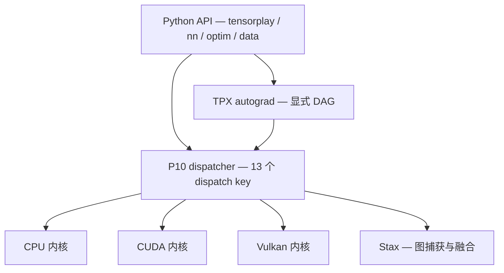

<div align="center">
    <p>
        <picture>
            <source media="(prefers-color-scheme: dark)" srcset="https://raw.githubusercontent.com/lexing-2026/TensorPlay/main/docs/images/tensorplay-lockup-dark.png">
            <source media="(prefers-color-scheme: light)" srcset="https://raw.githubusercontent.com/lexing-2026/TensorPlay/main/docs/images/tensorplay-lockup.png">
            
        </picture>
    </p>

<p>
    <a href="https://www.tensorplay.cn/zh/guide/tutorials"><strong>教程</strong></a> •
    <a href="https://www.tensorplay.cn/"><strong>文档</strong></a> •
    <a href="#快速上手"><strong>快速上手</strong></a> •
    <a href="#安装"><strong>安装指南</strong></a>
</p>

<p>
    <a href="./README.md"><strong>EN</strong></a> ·
    <a href="./README.zh.md">中文</a>
</p>

<p>
    <a href="https://download.tensorplay.cn/project/tensorplay/">
        
    </a>
    <a href="https://download.tensorplay.cn/status/">
        
    </a>
    <a href="#安装">
        
    </a>
    <a href="./LICENSE">
        
    </a>
    <a href="https://download.tensorplay.cn/project/tensorplay/stats/">
        
    </a>
    <a href="#安装">
        
    </a>
</p>
</div>

<details>
<summary>构建矩阵与社区信号</summary>

<p>
    <a href="https://github.com/lexing-2026/TensorPlay/actions/workflows/lint.yml">
        
    </a>
    <a href="./README.md">
        
    </a>
    <a href="./README.zh.md">
        
    </a>
</p>

<!-- 平台与构建 -->
<p>
    
    
    
    
    
</p>

<!-- CI -->
<p>
    <a href="https://github.com/lexing-2026/TensorPlay/actions/workflows/trunk.yml">
        
    </a>
    <a href="https://github.com/lexing-2026/TensorPlay/actions/workflows/trunk.yml">
        
    </a>
    <a href="https://github.com/lexing-2026/TensorPlay/actions/workflows/trunk.yml">
        
    </a>
</p>

<!-- 社区 -->
<p>
    <a href="https://github.com/lexing-2026/TensorPlay/stargazers">
        
    </a>
    <a href="https://github.com/lexing-2026/TensorPlay/commits/main">
        
    </a>
    <a href="https://discord.gg/u6T5e2kGJm">
        
    </a>
    <a href="https://deepwiki.com/lexing-2026/TensorPlay">
        
    </a>
    <a href="https://www.tensorplay.cn/">
        
    </a>
</p>

</details>

<h3>
    <samp>一个面向学习者的 DIY 友好型深度学习框架<br>
    旨在揭示神经网络内部机制并促进自定义硬件实验</samp>
</h3>

TensorPlay 是一个 Python 软件包，提供两大高层能力：

- 带有强大 GPU 加速的张量计算（类 NumPy）
- 建立在显式、基于磁带（tape）机制的自动微分系统之上的深度神经网络

整个技术栈——Python API、C++ 核心、CUDA 内核、编译器——都为「可读」而生：实现干净、计算图显式，模型与硬件之间没有黑盒。

## 关于 TensorPlay

### 一个透明的张量库

在更细的粒度上，TensorPlay 由以下组件构成：

| 组件 | 说明 |
| ---- | ---- |
| **tensorplay** | Python API：张量、自动微分、`nn`、`optim`、数据加载、序列化——对外公开层 |
| **p10** | C++ 核心引擎：张量存储与内存管理、基础的 CPU 与 CUDA 内核实现 |
| **tpx** | 自动微分层：显式构建计算图并执行反向传播，与核心完全解耦 |
| **stax** | JIT 编译器试验场：静态图捕获与算子融合实验，支持自定义算子的原生下沉 |
| **tensorplay.nn** | 神经网络构件：`Module`、`Linear`、`Conv2d`、激活函数、损失函数与容器抽象 |
| **tensorplay.optim** | 优化器（SGD、Adam、AdamW），支持学习率调度与权重衰减 |
| **tensorplay.data** | `Dataset` / `DataLoader`：多 worker 批处理、预取 (prefetch) 与自动打乱 |
| **tensorplay.library** | 一等公民的自定义算子：注册算子、挂接 fake/meta 与自动微分公式、接入自有 Triton kernel |

四大支柱——**P10**、**TPX**、**Stax** 与 **NN**——是刻意解耦的核心库，既可协同工作，也可独立使用。`linalg`、`fft`、`sparse`、`special`、`amp`、`distributed`、`serialization` 等领域子包补全了完整的 API 面。

每一次调用都是一条简短可见的路径——模型与硬件之间没有黑盒：



### 为什么选择 TensorPlay

TensorPlay 以**透明架构**为设计哲学：每个操作都能从 Python 追踪到 C++ 核心，而不会迷失在抽象层中。

- **纯粹且可读的实现。** 深入理解每个算子的底层逻辑——从自动微分到内存管理，没有黑盒。
- **DIY 硬件加速。** 简化的 CPU/CUDA 后端是实验自定义硬件内核、学习并行计算原理的游乐场。
- **模块化自动微分。** 解耦的 TPX 引擎显式构建计算图，反向传播的原理一目了然，且易于扩展。
- **研究就绪。** 以极少的样板代码原型化新的层类型、优化器、自定义算子与存储格式。
- **亲切的 API 风格。** 用过主流深度学习框架的话，心智模型可以直接迁移——把时间花在理解内部机制上，而不是语法上。

#### 亲切且 Python 优先

TensorPlay 不是套在不透明引擎上的薄封装。公开接口——`tensorplay`、`nn`、`optim`、`data`——是能从头读到尾的纯 Python 代码，每次调用都会经过一个简短、显式的边界进入 C++ 核心。堆栈跟踪、错误信息和调试器里显示的是**你的**代码，而不是框架的水管工。

#### DIY 硬件加速

CPU 与 CUDA 后端刻意做了简化：每个文件一族内核、每个单元一个注册宏、没有隐藏的调度。这让它们成为学习并行计算、原型化内核的游乐场——带上你自己的设备后端接入 dispatcher，不需要改动框架本身。

#### 显式的自动微分引擎

自动微分引擎（TPX）是独立库，与核心完全解耦。计算图的构建与执行都是显式的——没有隐藏状态——反向传播是你一个下午就能读懂、追踪并扩展的东西。

#### 无痛扩展

一等公民的自定义算子：用 `tensorplay.library` 注册算子，挂上 fake/meta 公式做形状推断、挂上自动微分公式做反向传播，它就能与整个技术栈协同——包括原生下沉进 Stax 编译器，或接入你自己的 Triton kernel。

## 安装

### 二进制安装

```bash
# 从 PyPI 安装 CPU 版本
pip install tensorplay --upgrade

# 从 TensorPlay CUDA 源安装 CUDA 13.0 版本
# PyPI 作为运行时依赖的额外索引
pip install tensorplay \
  --index-url https://download.tensorplay.cn/whl/cu130/ \
  --extra-index-url https://pypi.org/simple
```

> [!NOTE]
> 请确保 Python 版本与 wheel 标签匹配（如 `cp310` 对应 Python 3.10）。CUDA 版本要求驱动与运行时支持对应 CUDA 版本。

> [!TIP]
> CUDA 13.0 wheel 仅面向计算能力 8.6 的 GPU。若你的 GPU 计算能力不同（或 wheel 无法在你的设备上运行），请改为[从源码构建](#从源码构建)，并通过 `CMAKE_CUDA_ARCHITECTURES` 指定目标架构——默认值 `native` 会自动探测本机 GPU。

### Nightly（预览版）

预览明天的功能：每一处通过构建与冒烟流水线的改动都会自动进入滚动的 `nightly` 通道，采用 nightly 版本号格式（`X.Y.0.dev<日期>+cuXXX` / `+cpu`）。每个变体仅保留最新一次构建。

```bash
# CUDA nightly
pip install --pre tensorplay \
  --index-url https://download.tensorplay.cn/whl/nightly/cu130/ \
  --extra-index-url https://pypi.org/simple

# CPU nightly
pip install --pre tensorplay \
  --index-url https://download.tensorplay.cn/whl/nightly/cpu/ \
  --extra-index-url https://pypi.org/simple
```

### 从源码构建

源码构建得到的是可魔改、可调试的安装——推荐贡献者以及所有研究内核的开发者使用。

#### 环境要求

- Python >= 3.10，< 3.14
- CMake >= 3.18（< 4.0）
- 支持 C++20 的编译器（Windows 使用 MSVC 2022，Linux 使用 GCC/Clang）
- CUDA Toolkit（可选，用于 GPU 支持）；可通过 `CMAKE_CUDA_ARCHITECTURES` 指定目标 GPU 架构
- ROCm 7.2.x（可选，用于 AMD GPU 支持）；HIP 后端当前通过源码构建
- [Ninja](https://ninja-build.org/)（随构建依赖自动安装）

#### 获取源码

```bash
git clone https://github.com/lexing-2026/TensorPlay.git
cd TensorPlay
```

#### 安装构建依赖

隔离的 PEP 517 构建会自动获取全部依赖。若需更快的迭代开发，可先装好工具链再关闭隔离：

```bash
pip install -r requirements-build.txt
```

#### 安装 TensorPlay

TensorPlay 通过 `pyproject.toml` 中声明的标准 PEP 517 接口由 scikit-build-core 构建：

```bash
# 完整构建并安装（加 -v 可查看详细输出）
pip install .

# 开发用可编辑安装
pip install -e . --no-build-isolation

# 或只产出 wheel 不安装
python -m build --wheel
```

构建成功后，`import tensorplay` 会加载安装包内编译好的 `_C` 扩展。

> [!TIP]
> 日常内核开发推荐可编辑安装（`pip install -e . --no-build-isolation`），只重编译改动的部分。

#### 调整构建选项（可选）

构建由环境变量驱动——无需 `-D` 参数：

<details>
<summary>示例与完整变量表</summary>

```bash
# 仅构建 CPU 版本
USE_CUDA=OFF pip install .

# 使用 ROCm 7.2 / HIP 构建 AMD GPU 版本
USE_CUDA=OFF USE_ROCM=ON pip install .

# 指定目标 GPU 架构
CMAKE_CUDA_ARCHITECTURES="70;75;86" pip install .
```

| 变量 | 默认值 | 说明 |
| ---- | ---- | ---- |
| `USE_CUDA` | 自动探测 | 启用/禁用 CUDA 构建 |
| `USE_ROCM` | `OFF` | 启用 AMD GPU / HIP 构建（与 `USE_CUDA` 互斥） |
| `BUILD_TESTS` | `OFF` | 构建 C++ 测试套件 |
| `USE_BLAS` / `USE_ONEDNN` | `ON` | BLAS 加速 / oneDNN 算子库 |
| `MAX_JOBS` | 机器默认 | 限制编译并行度 |
| `DEBUG` | 未设置 | 以 `-O0 -g` 构建 |
| `CMAKE_CUDA_ARCHITECTURES` | 本机架构 | 分号分隔的 GPU 架构列表 |
| `TENSORPLAY_BUILD_VERSION` / `TENSORPLAY_BUILD_NUMBER` | 未设置 | 覆盖包版本号（发布 CI 使用） |

所有 `USE_*`、`BUILD_*`、`CMAKE_*` 环境变量都会自动转发给 CMake——无需任何额外参数。

</details>

## 快速上手

### 自动微分

```python
import tensorplay as tp

x = tp.Tensor([[1.0, 2.0], [3.0, 4.0]], requires_grad=True)
y = tp.Tensor([[5.0, 6.0], [7.0, 8.0]], requires_grad=True)

z = x.matmul(y) + tp.ones_like(x)
loss = z.sum()
loss.backward()

print(x.grad)  # [[6., 6.], [6., 6.]]
```

在底层，TPX 把每个操作记录进一张显式的 DAG，并逐节点重放链式法则：$\dfrac{\partial \mathcal{L}}{\partial x} = \dfrac{\partial \mathcal{L}}{\partial z} \cdot \dfrac{\partial z}{\partial x}$ —— 图的每一条边都是你可以单步调试的代码。

### 定义神经网络

```python
import tensorplay as tp
from tensorplay.nn import Module, Linear, ReLU, Sigmoid

class MLP(Module):
    def __init__(self, input_dim: int, hidden_dim: int, output_dim: int):
        super().__init__()
        self.fc1 = Linear(input_dim, hidden_dim)
        self.relu = ReLU()
        self.fc2 = Linear(hidden_dim, output_dim)
        self.sigmoid = Sigmoid()

    def forward(self, x: tp.Tensor) -> tp.Tensor:
        x = self.relu(self.fc1(x))
        return self.sigmoid(self.fc2(x))

model = MLP(10, 32, 1)
print(model)  # 自动生成层结构可视化
```

### 训练循环

```python
from tensorplay.data import DataLoader, TensorDataset

train_data = TensorDataset(tp.randn(100, 10), tp.randn(100, 1))
train_loader = DataLoader(dataset=train_data, batch_size=8, shuffle=True)

for batch_x, batch_y in train_loader:
    predictions = model(batch_x)
    # ... 计算损失、调用 loss.backward()、更新优化器
```

体系化教程——从零开始的线性回归、MNIST CNN 图像分类、自定义数据集、`.mega` + `state_dict` 模型保存与加载——见 [tensorplay.cn](https://www.tensorplay.cn/zh/guide/tutorials)。深度长文，一篇一个支柱——dispatch、autograd 引擎、张量存储、编译器——见[博客系列](docs/blogs/00-index.md)。

## 基准测试

<p align="center">
  
</p>

[benchmark/](benchmark/) 套件度量的是一个「可读的框架」要付出什么代价——同时验证正确性。每项对比都在完全相同的初始权重、确定性数据顺序、相同的优化器与批次设置下运行两套运行时；门槛很严：任何计时开始之前，logits 必须在 `allclose` 容差内一致，Top-1 预测必须完全相同。

- **端到端训练**：ResNet-18 图像分类，覆盖 CPU 与 CUDA、eager 与编译模式（`stax`，原生下沉），报告 train/eval/test 精度与吞吐
- **微观与子系统**：GEMM、优化器 step、dataloader、序列化、autograd Function 开销、自定义算子调用开销、LLaMA 端到端
- **报告**：每个脚本输出 JSON 报告（`--json-out`）——吞吐、延迟分位数、编译开销——可直接绘图并用于[白皮书](docs/whitepaper/main.pdf)评估

实测亮点（见[白皮书](docs/whitepaper/main.pdf) §9）：dispatcher 在 CPU、CUDA 与 Vulkan 路径上都只增加不到 1% 的开销；CUDA 后端覆盖 1,274 个独立算子（CPU 面的 96%）；Vulkan 教学后端交付 145 个算子，背后是 4.5k 行 GLSL shader。

脚本与方法论：[benchmark/README.md](benchmark/README.md)。

## 测试

Python 测试套件使用 pytest 针对已安装（或原地构建）的包运行：

```bash
pytest test/
```

CI 会在每个 PR 和 main 推送上构建完整 wheel 矩阵（Python 3.10–3.13；CPU 覆盖 Linux x86_64/aarch64、macOS arm64、Windows x86_64；CUDA 覆盖 Linux 和 Windows x86_64）并验证每个 wheel；参见 [.github/workflows/](.github/workflows/)（`pull`、`trunk`、`publish`、`lint`）。Lint 规则位于 `pyproject.toml` 的 `[tool.ruff]` 段。

## 资源

- **文档：** [tensorplay.cn](https://www.tensorplay.cn/)
- **教程：** [tensorplay.cn/zh/guide/tutorials](https://www.tensorplay.cn/zh/guide/tutorials)
- **白皮书：** [docs/whitepaper/main.pdf](docs/whitepaper/main.pdf) —— 全栈剖析，附 `path:line` 引用
- **博客：** [docs/blogs](docs/blogs/00-index.md) —— 一篇一个支柱
- **基准测试：** [benchmark/](benchmark/)
- **社区：** [Discord](https://discord.gg/u6T5e2kGJm)

## 社区交流

- **Discord**：[discord.gg/u6T5e2kGJm](https://discord.gg/u6T5e2kGJm) —— 提问、想法、作品展示
- **GitHub Issues**：缺陷报告、功能建议、RFC
- **邮箱**：feedback@tensorplay.cn

## 发布与贡献

包版本号以 [`version.txt`](version.txt) 为单一来源（开发安装会带 `+git<sha>` 后缀）。正式发布通过推送 `v主版本.次版本.0` tag 触发；例如 `v1.2.1` 这样的修订版本 tag 不会发布二进制包。CI 流水线自动构建并验证完整 wheel 矩阵，CPU wheel 发布到 PyPI，CUDA wheel 上传到 GitHub Release，并将其 PEP 503 索引部署到 Cloudflare Pages。wheel 矩阵基础设施（平台 runner、CUDA 变体、可选 ROCm 通道）见 [RELEASE.md](RELEASE.md)。

我们欢迎各种形式的贡献——bug 修复、文档改进、新功能建议。开发流程与编码规范见 [CONTRIBUTING.md](CONTRIBUTING.md)。

<a href="https://github.com/lexing-2026/TensorPlay/graphs/contributors">
  
</a>

## 许可证

TensorPlay 采用 [Apache 2.0 许可证](LICENSE)。

<a href="https://www.star-history.com/?repos=lexing-2026%2FTensorPlay&type=date&legend=top-left">
 <picture>
   <source media="(prefers-color-scheme: dark)" srcset="https://api.star-history.com/chart?repos=lexing-2026/TensorPlay&type=date&theme=dark&legend=top-left" />
   <source media="(prefers-color-scheme: light)" srcset="https://api.star-history.com/chart?repos=lexing-2026/TensorPlay&type=date&legend=top-left" />
   
 </picture>
</a>

## 开发组织

<table align="center">
    <tr>
        <td width="96" align="center">
            <a href="https://github.com/ohtensorplay">
                
            </a>
        </td>
        <td>
            <strong><a href="https://github.com/ohtensorplay">ohtensorplay</a></strong><br>
            为想要理解、实验并构建 AI 系统的人，<br>提供开放的工具与基础设施。<br>
            <sub>组织使命 · 让每个人都能成为优秀的 AI 构建者</sub>
        </td>
    </tr>
</table>

### 项目

- **[megatensors](https://github.com/ohtensorplay/megatensors)** —— MEGA Hub 的 Python SDK，为 `.mega` 序列化、`mega://` 存储后端与 hub 模型加载提供支撑。

### 其他依赖

| 依赖 |
|------------|
| [NumPy](https://numpy.org/) |
| [SymPy](https://www.sympy.org/) |
| [TensorBoard](https://github.com/tensorflow/tensorboard) |
| [Pillow](https://python-pillow.org/) |
| [pybind11](https://github.com/pybind/pybind11) |

探索全部 [ohtensorplay](https://github.com/ohtensorplay) 项目——点个 ⭐ 并持续关注。
